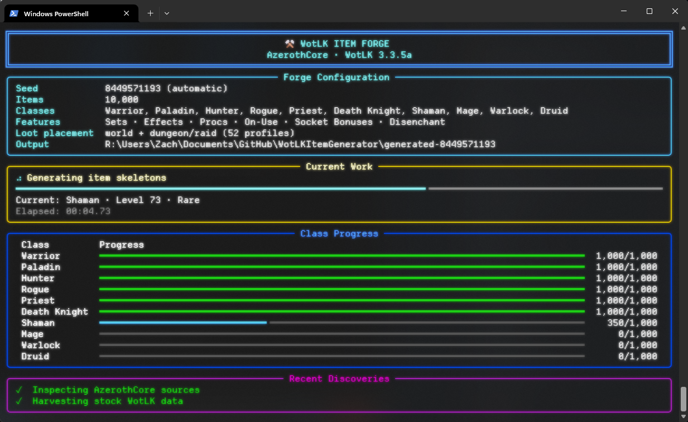
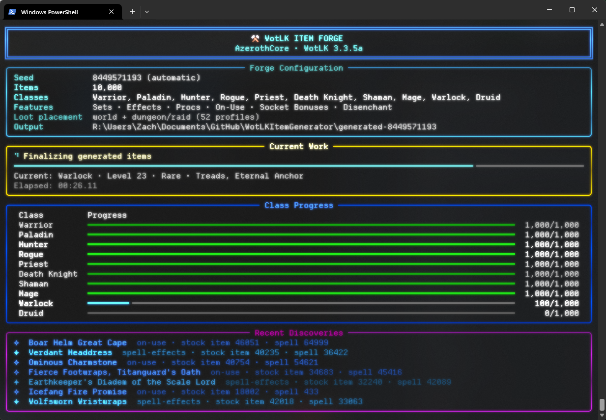
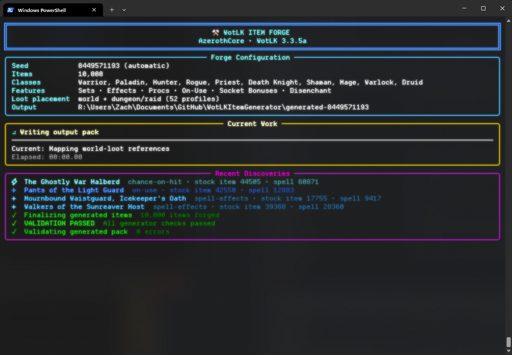
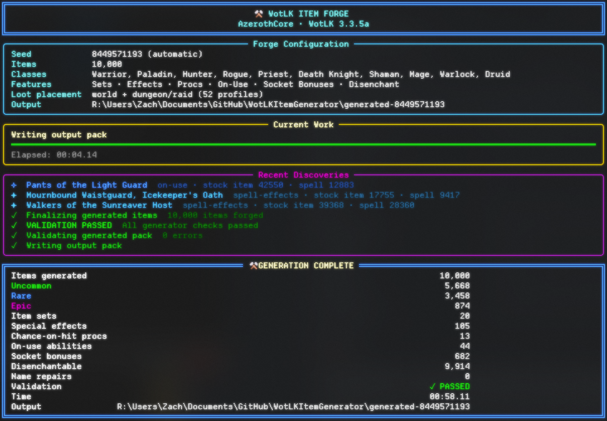

# AzerothCore WotLK Item Generator: Architecture and Technical Reference

This document contains the detailed technical reference for the generator. Start with [README.md](README.md) for the short operator guide.

The generator targets AzerothCore and World of Warcraft: Wrath of the Lich King 3.3.5a (build 12340). It creates deterministic custom item packs, server SQL, loot integrations, client DBC output, validation reports, and rollback helpers.

> The generator writes files only. It does not connect to or modify a live database.

## Current Feature Highlights

The current generator also supports:

- generated five-piece class/role item sets with stock two-piece and four-piece bonuses
- stock On Equip, Chance on Hit, and On Use effect packages validated against WotLK DBC and SQL sources
- stock socket bonuses resolved through `SpellItemEnchantment.dbc`
- validated stock `DisenchantID` assignments
- additive, conflict-safe merging of multiple `Item.dbc` baselines
- generated `ItemSet.dbc` output for both the client and AzerothCore worldserver
- an optional Rich terminal dashboard with plain, quiet, and no-animation modes
- manifest-driven disjoint recipes for exact counts, independent required/item-level ranges, weapons, qualities, and sets
- automatic dungeon/raid encounter integration from the checked-in AzerothCore DBC/SQL sources, plus explicit manifest overrides
- safe fixed and choice quest-reward assignment that fills empty slots and emits reversible SQL

See [Docs/CLI_UI.md](Docs/CLI_UI.md) for the dashboard behavior and inspect each generated `validation_report.json` for feature counts and source-audit results.






---

## Table of Contents

1. [What the Generator Does](#what-the-generator-does)
2. [Core Design Goals](#core-design-goals)
3. [Quick Start](#quick-start)
4. [Requirements](#requirements)
5. [Expected Project Layout](#expected-project-layout)
6. [How Generation Works](#how-generation-works)
7. [Deterministic Seeds](#deterministic-seeds)
8. [Generation Counts and Class Allocation](#generation-counts-and-class-allocation)
9. [Item ID Allocation](#item-id-allocation)
10. [Level Distribution](#level-distribution)
11. [Item Level Generation](#item-level-generation)
12. [Quality and Legendary Generation](#quality-and-legendary-generation)
13. [Class Roles](#class-roles)
14. [Slots, Armor Progression, and Weapons](#slots-armor-progression-and-weapons)
15. [Role-Compatible Class Masks](#role-compatible-class-masks)
16. [Stat Generation](#stat-generation)
17. [Sockets](#sockets)
18. [Weapon Damage, Speed, Armor, and Durability](#weapon-damage-speed-armor-and-durability)
19. [Naming System](#naming-system)
20. [Legendary Naming and Flavor](#legendary-naming-and-flavor)
21. [Appearance Harvesting](#appearance-harvesting)
22. [Client Models, Textures, and Icons](#client-models-textures-and-icons)
23. [Item.dbc Generation and Merging](#itemdbc-generation-and-merging)
24. [World Loot Integration](#world-loot-integration)
25. [Validation and Safety Rules](#validation-and-safety-rules)
26. [Command-Line Reference](#command-line-reference)
27. [Class Names and Aliases](#class-names-and-aliases)
28. [Usage Examples](#usage-examples)
29. [Generated Output Structure](#generated-output-structure)
30. [Importing a Generated Pack](#importing-a-generated-pack)
31. [Removing a Generated Pack](#removing-a-generated-pack)
32. [Troubleshooting](#troubleshooting)
33. [Reproducibility](#reproducibility)
34. [Intentional Non-Features](#intentional-non-features)
35. [Technical Reference](#technical-reference)
36. [FAQ](#faq)

---

# What the Generator Does

The generator creates randomized but constrained WotLK equipment with a strong emphasis on:

- AzerothCore-compatible SQL
- WotLK 3.3.5a client compatibility
- large-scale generation
- reproducibility
- level progression
- role-appropriate stats
- armor and weapon proficiency
- shared class masks where appropriate
- stock WotLK visual reuse
- client `Item.dbc` generation
- world-loot integration
- collision checking
- safe rollback files

A normal generated item may include:

- a unique custom item entry
- a unique generated name
- quality
- required level
- item level
- class mask
- armor or weapon subclass
- inventory slot
- one to five static stats
- an optional stock-derived spell effect, proc, or On Use package
- weapon damage and speed where applicable
- armor and block values where applicable
- zero to three sockets
- a stock socket bonus when eligible
- a validated disenchant entry when eligible
- membership in a generated item set when selected
- vendor prices
- durability
- binding rules
- flavor text
- a verified stock WotLK `displayid`
- a matching `Item.dbc` row
- placement in a generated level-bracket loot pool

The generator produces equipment for:

- Warrior
- Paladin
- Hunter
- Rogue
- Priest
- Death Knight
- Shaman
- Mage
- Warlock
- Druid

Supported generated equipment includes:

- cloth armor
- leather armor
- mail armor
- plate armor
- cloaks
- necklaces
- rings
- trinkets
- shields
- class relics
- one-handed swords
- two-handed swords
- one-handed axes
- two-handed axes
- one-handed maces
- two-handed maces
- polearms
- daggers
- staves
- fist weapons
- bows
- guns
- crossbows
- wands

---

# Core Design Goals

The generator follows several deliberate rules.

## 1. Generate first, validate second, write last

Items are fully generated and validated before the output-writing stage begins.

If item validation fails, the generator exits instead of intentionally writing an invalid SQL pack.

## 2. Reuse verified WotLK data

The generator does not invent arbitrary `displayid` values.

Instead, it reads the supplied stock AzerothCore `item_template.sql`, harvests compatible reference items, and reuses verified stock display IDs.

## 3. Preserve normal WotLK progression

The generator attempts to produce items that feel plausible across:

- low-level leveling
- Vanilla-era progression
- Outland progression
- Northrend progression
- level 80 dungeon and raid item levels

## 4. Avoid obviously broken procedural names

Generated names are constrained by:

- maximum length
- maximum word count
- global uniqueness within the pack
- CamelCase rejection
- repeated meaningful-word rejection
- compound-root repetition rejection
- armor-material-aware terminology

For example, the generator rejects names such as:

```text
Dusk Dusk Wargrips
Earthshard Shard Cowl
Last Warden's Warden Wargrips
Titan Queen's Hauberk of the Titan Forge
```

## 5. Reuse verified stock effects and metadata

The generator copies only compatible stock data instead of inventing IDs:

- On Equip, Chance on Hit, and On Use spell packages are validated against `Spell.dbc`, `spell_proc.sql`, and `spell_script_names.sql`.
- Generated sets use `ItemSet.dbc` templates and are emitted for both client and server use.
- Socket bonuses are resolved through `SpellItemEnchantment.dbc`.
- Disenchant data is copied only when the source `DisenchantID` exists in `disenchant_loot_template.sql`.

`RandomProperty` and `RandomSuffix` remain zero, and the generator still does not create custom models or write directly to a live database.

---

# Quick Start

## Windows / PowerShell

From the generator directory:

```powershell
py .\generate_pack.py
```

This creates the default:

```text
100,000 total items
10,000 per class
2% world-loot attachment chance
automatic seed
dungeon/raid encounter loot integration
```

For a small test run:

```powershell
py .\generate_pack.py --number 100
```

For a deterministic test:

```powershell
py .\generate_pack.py --seed 1234567890 --number 100
```

For a Warrior-only test:

```powershell
py .\generate_pack.py --class warrior --number 100
```

For the live terminal dashboard when Rich is installed:

```powershell
py .\generate_pack.py --ui fancy
```

The default `--ui auto` mode uses the dashboard only in an interactive terminal and falls back to the standard-library UI otherwise.

## Linux / macOS

```bash
python3 ./generate_pack.py
```

or:

```bash
python3 ./generate_pack.py --seed 1234567890 --number 100
```

---

# Requirements

## Python

A modern Python 3 interpreter is required.

The generator imports only Python standard-library modules. No third-party Python package installation is required.

The script uses modules including:

- `argparse`
- `csv`
- `hashlib`
- `json`
- `math`
- `os`
- `re`
- `shutil`
- `struct`
- `uuid`
- `zipfile`
- `collections`
- `datetime`
- `pathlib`

## AzerothCore source files

By default, the generator expects access to the following AzerothCore world database source files:

```text
data/sql/base/db_world/creature_loot_template.sql
data/sql/base/db_world/reference_loot_template.sql
data/sql/base/db_world/item_template.sql
data/sql/base/db_world/disenchant_loot_template.sql
data/sql/base/db_world/spell_proc.sql
data/sql/base/db_world/spell_script_names.sql
```

Targeted quest rewards additionally require an explicit `--quest-template-source PATH`.

These are used for:

- world-loot level mapping
- reference-loot verification
- appearance harvesting
- weapon reference harvesting
- stock spell-effect and proc validation
- validated disenchant assignments

## Client and feature DBCs

The generator requires valid WotLK copies of:

```text
Item.dbc
ItemSet.dbc
Spell.dbc
SpellItemEnchantment.dbc
```

By default it looks for:

```text
Item.dbc
```

beside `generate_pack.py`.

If this file also exists beside the generator:

```text
Item.custom.dbc
```

it is automatically merged as an additional baseline.

`Item.custom.dbc` is optional.

`ItemSet.dbc`, `Spell.dbc`, and `SpellItemEnchantment.dbc` are required by the default feature set. Their paths can be overridden with the corresponding command-line options.

---

# Expected Project Layout

The default input bundle lives under `Data/` beside `generate_pack.py`. SQL and DBC inputs are local files ignored by Git, so provide a matching AzerothCore/WotLK source bundle when setting up a clone.

```text
WotLKItemGenerator/
├─ generate_pack.py
├─ README.md
├─ Architecture.md
├─ Data/
│  ├─ creature_loot_template.sql
│  ├─ reference_loot_template.sql
│  ├─ item_template.sql
│  ├─ disenchant_loot_template.sql
│  ├─ spell_proc.sql
│  ├─ spell_script_names.sql
│  ├─ Item.dbc
│  ├─ Item.custom.dbc             # optional additional Item.dbc baseline
│  ├─ ItemSet.dbc
│  ├─ Spell.dbc
│  ├─ SpellItemEnchantment.dbc
│  ├─ Map.dbc
│  ├─ MapDifficulty.dbc
│  ├─ DungeonMap.dbc
│  ├─ creature.sql
│  ├─ creature_template.sql
│  └─ instance_encounters.sql
├─ Docs/
│  ├─ CLI_UI.md
│  └─ content_manifest.example.json
└─ Tests/
```

The normal command uses the files under `Data/` automatically:

```powershell
py generate_pack.py
```

Targeted quest rewards additionally require a compatible `quest_template.sql` passed with `--quest-template-source`.

All input paths can be overridden independently with the corresponding command-line options. Explicit paths take precedence over the defaults above.

# How Generation Works

At a high level, each run follows this pipeline:

```text
Parse command-line arguments
        ↓
Load optional targeted-content manifest
        ↓
Resolve source paths
        ↓
Verify required source files
        ↓
Load stock spell, set, socket, proc, and disenchant catalogs
        ↓
Harvest stock armor/weapon appearances
        ↓
Choose or derive deterministic seed
        ↓
Build class/count generation plan
        ↓
Allocate deterministic item IDs
        ↓
Generate required levels
        ↓
Generate item levels
        ↓
Choose quality
        ↓
Choose class role
        ↓
Choose slot / armor / weapon structure
        ↓
Build role-compatible class mask
        ↓
Promote extremely rare Legendaries
        ↓
Choose verified stock appearance
        ↓
Generate stats
        ↓
Generate sockets
        ↓
Assign effects, socket bonuses, disenchant data, and item sets
        ↓
Resolve encounter order, weighted targets, and quest assignments
        ↓
Generate damage / armor / block
        ↓
Generate name and flavor
        ↓
Generate prices / durability / binding
        ↓
Validate the complete item set
        ↓
Build world-loot pools
        ↓
Merge client Item.dbc
        ↓
Merge and stage client/server ItemSet.dbc
        ↓
Write SQL, CSV, JSON, commands, reports, checks, and README
```

The generator uses deterministic hash-based random selection throughout the process.

It does not rely on SQL `RAND()`.

---

# Deterministic Seeds

Every generation run has a seed.

The seed controls deterministic choices such as:

- item levels
- quality
- role
- slot
- weapon type
- reference appearance
- stat selection
- stat values
- sockets
- weapon speed
- damage variation
- names
- flavor text
- Legendary promotion order

## Automatic seeds

If `--seed` is not supplied, the generator creates an automatic seed.

It stores a persistent UUID in:

```text
~/.azerothcore-item-generator-guid
```

On Windows, `~` resolves to the current user's home directory.

The automatic seed is derived from:

```text
persistent user UUID
+
local date
+
local time
```

using BLAKE2b hashing.

Automatic seeds are formatted as a ten-digit number.

The selected seed is printed when generation starts:

```text
Generator seed: 6003911716 (automatic)
```

## Manual seeds

Use:

```powershell
py .\generate_pack.py --seed 1234567890
```

Manual seeds:

- must contain digits only
- may contain leading zeros
- are treated as strings for deterministic hashing
- become part of the output folder name

Example:

```text
generated-1234567890/
```

## Reusing a seed

The same:

- generator version
- seed
- generation arguments
- source `item_template.sql`
- relevant input data

will reproduce the same deterministic generation decisions.

Changing the stock appearance source can change appearance/reference selections even with the same seed.

---

# Generation Counts and Class Allocation

## Default run

Without `--class`:

```text
100,000 items total
10 classes
10,000 items per class
```

## Maximum run

The hard total maximum is:

```text
200,000 items
```

The hard per-class maximum is:

```text
20,000 items
```

Therefore:

```powershell
py .\generate_pack.py --number 200000
```

produces:

```text
20,000 items per class
```

## Single-class mode

When `--class` is used, the default count becomes:

```text
10,000 items
```

Example:

```powershell
py .\generate_pack.py --class rogue
```

Maximum:

```powershell
py .\generate_pack.py --class rogue --number 20000
```

## Uneven custom totals

When no class is specified, custom totals are divided across all ten classes.

The quotient is assigned to every class. Any remainder is assigned in class declaration order:

1. Warrior
2. Paladin
3. Hunter
4. Rogue
5. Priest
6. Death Knight
7. Shaman
8. Mage
9. Warlock
10. Druid

For example:

```powershell
py .\generate_pack.py --number 23
```

produces:

```text
Warrior       3
Paladin       3
Hunter        3
Rogue         2
Priest        2
Death Knight  2
Shaman        2
Mage          2
Warlock       2
Druid         2
```

---

# Item ID Allocation

The generator reserves a 20,000-ID block for each class.

| Class | Class Mask | Reserved Entry Range |
|---|---:|---:|
| Warrior | 1 | 200000-219999 |
| Paladin | 2 | 220000-239999 |
| Hunter | 4 | 240000-259999 |
| Rogue | 8 | 260000-279999 |
| Priest | 16 | 280000-299999 |
| Death Knight | 32 | 300000-319999 |
| Shaman | 64 | 320000-339999 |
| Mage | 128 | 340000-359999 |
| Warlock | 256 | 360000-379999 |
| Druid | 1024 | 380000-399999 |

The entry for a class is:

```text
class block start + local item index
```

For example, the first generated Rogue entry is:

```text
260000
```

and the 10,000th default Rogue item is:

```text
269999
```

The default 100,000-item pack uses only the first 10,000 IDs of each 20,000-ID block.

The second half of every block is reserved for runs up to the 20,000-per-class maximum.

---

# Level Distribution

## Normal classes

Most classes generate items from:

```text
RequiredLevel 1-80
```

## Death Knight

Death Knight generation is deliberately restricted to:

```text
RequiredLevel 55-80
```

No Death Knight item is generated below level 55.

## Full 10,000-item class cycles

Each complete 10,000-item generation cycle guarantees at least:

```text
100 items at every playable level
```

For a normal class, that means levels 1 through 80.

For Death Knight, that means levels 55 through 80.

After guaranteed coverage is added, the remaining item levels are weighted toward later progression.

Extra-level weighting is approximately:

| Required Level | Relative Weight |
|---|---:|
| 1-19 | 0.5 |
| 20-39 | 0.8 |
| 40-59 | 1.0 |
| 60-69 | 1.5 |
| 70-74 | 2.5 |
| 75-79 | 5.0 |
| 80 | 20.0 |

This causes endgame items to be substantially more common without sacrificing baseline leveling coverage in full class cycles.

---

# Item Level Generation

Item level is generated separately from required level.

## Below required level 58

Item level is roughly:

```text
RequiredLevel + 1 through RequiredLevel + 7
```

## Required level 58-67

The generator transitions into Outland-era item levels using a scaling formula beginning around item level 80.

## Required level 68-74

The generator moves into early Northrend-style item levels beginning around 112.

## Required level 75-79

The curve begins around item level 160 and rises toward level 80.

## Required level 80

Level 80 uses a weighted discrete item-level table:

| Item Level | Relative Weight |
|---:|---:|
| 187 | 8 |
| 200 | 15 |
| 213 | 15 |
| 219 | 10 |
| 226 | 10 |
| 232 | 10 |
| 239 | 7 |
| 245 | 7 |
| 251 | 5 |
| 258 | 5 |
| 264 | 4 |
| 271 | 2 |
| 277 | 1.5 |
| 284 | 0.5 |

This allows the generator to cover:

- entry level-80 gear
- dungeon/heroic-style progression
- Naxxramas-level gear
- Ulduar-level gear
- Trial of the Crusader-level gear
- Icecrown Citadel-level gear

without making the highest item levels common.

---

# Quality and Legendary Generation

Supported generated qualities are:

```text
2 = Uncommon
3 = Rare
4 = Epic
5 = Legendary
```

The generator does not create Poor, Common, Artifact, or Heirloom equipment.

## Hard endgame quality caps

The generator prevents low-quality items from appearing at absurd raid item levels.

Rules:

```text
Uncommon maximum item level: 213
Rare maximum item level:     226
```

Anything above item level 226 is automatically Epic before Legendary promotion.

## Base quality weights

### Required level 1-19

```text
Uncommon  82%
Rare      17.8%
Epic       0.2%
```

### Required level 20-39

```text
Uncommon  72%
Rare      27.5%
Epic       0.5%
```

### Required level 40-59

```text
Uncommon  60%
Rare      38.5%
Epic       1.5%
```

### Required level 60-69

```text
Uncommon  50%
Rare      45%
Epic       5%
```

### Required level 70-74

```text
Uncommon  38%
Rare      50%
Epic      12%
```

### Required level 75-79

```text
Uncommon  25%
Rare      50%
Epic      25%
```

### Required level 80, item level 213 or below

```text
Uncommon  10%
Rare      55%
Epic      35%
```

### Item level 214-226

```text
Rare      30%
Epic      70%
```

### Item level 227+

```text
Epic     100%
```

before Legendary promotion.

## Legendary policy

Legendaries are deliberately extremely rare.

The target count is:

```text
floor(total generated items × 3 / 100000)
```

Examples:

| Generated Items | Legendary Target |
|---:|---:|
| 10,000 | 0 |
| 33,333 | 0 |
| 50,000 | 1 |
| 100,000 | 3 |
| 200,000 | 6 |

Eligible Legendary candidates must already be:

- required level 80
- item level 264 or higher
- Epic before promotion

The generator attempts to spread promoted Legendaries across different source classes before allowing multiple Legendaries from the same class.

Every Legendary receives:

- quality 5
- required level 80
- item level 264+
- exactly five stats
- at least two sockets
- a dedicated Legendary naming pattern
- guaranteed flavor text
- equipment-aware Legendary flavor

---

# Class Roles

Each source class receives one or more weighted roles.

| Class | Role Weights |
|---|---|
| Warrior | 60% Strength DPS, 40% Tank |
| Paladin | 45% Strength DPS, 30% Tank, 25% Healer |
| Hunter | 100% Hunter |
| Rogue | 100% Agility DPS |
| Priest | 55% Caster DPS, 45% Healer |
| Death Knight | 60% Strength DPS, 40% Tank |
| Shaman | 40% Agility DPS, 30% Caster DPS, 30% Healer |
| Mage | 100% Caster DPS |
| Warlock | 100% Caster DPS |
| Druid | 30% Agility DPS, 25% Caster DPS, 25% Healer, 20% Tank |

The selected role affects:

- stat pools
- weapon choices
- shield eligibility
- class-mask compatibility

---

# Slots, Armor Progression, and Weapons

Base slot weighting favors ordinary armor slots while still generating jewelry, trinkets, cloaks, and weapons.

The weighted slot pool includes:

- head
- neck
- shoulders
- back
- chest
- wrists
- hands
- waist
- legs
- feet
- finger
- trinket
- weapon

Relics are added for appropriate classes at level 50+.

## Low-level slot restrictions

Below level 10:

- shoulders are disabled
- trinkets are disabled
- head, neck, and finger are heavily reduced

From level 10-19:

- shoulders are uncommon
- trinkets are uncommon

This prevents very low-level loot tables from being dominated by equipment types that are normally less common early in progression.

## Armor progression

| Class | Levels | Generated Armor |
|---|---|---|
| Warrior | 1-39 | Mail |
| Warrior | 40-80 | Plate |
| Paladin | 1-39 | Mail |
| Paladin | 40-80 | Plate |
| Hunter | 1-39 | Leather |
| Hunter | 40-80 | Mail |
| Shaman | 1-39 | Leather |
| Shaman | 40-80 | Mail |
| Rogue | 1-80 | Leather |
| Druid | 1-80 | Leather |
| Priest | 1-80 | Cloth |
| Mage | 1-80 | Cloth |
| Warlock | 1-80 | Cloth |
| Death Knight | 55-80 | Plate |

## Material-aware armor terminology

Armor names are generated from subclass-specific noun pools.

Examples:

### Cloth

- Hood
- Cowl
- Circlet
- Robe
- Vestments
- Bindings
- Gloves
- Cord
- Leggings
- Footwraps

### Leather

- Mask
- Jerkin
- Harness
- Wristguards
- Grips
- Belt
- Breeches
- Stalkers

### Mail

- Coif
- Hauberk
- Chainmail
- Vambraces
- Wrist Chains
- Warbelt
- Legmail
- Greaves

### Plate

- Greathelm
- Pauldrons
- Breastplate
- Cuirass
- Battleplate
- Warplate
- Vambraces
- Gauntlets
- Legplates
- Sabatons

This prevents mismatches such as plate armor being called "Robes" or cloth armor being called "Warplate."

## Weapon weighting

Each class has a class-appropriate weapon pool.

For example:

### Warrior

- one-handed swords
- one-handed axes
- one-handed maces
- two-handed swords
- two-handed axes
- two-handed maces
- polearms
- bows
- guns
- crossbows

### Rogue

- daggers
- one-handed swords
- one-handed maces
- fist weapons
- bows
- guns
- crossbows

### Mage / Warlock

- staves
- daggers
- one-handed swords
- wands

### Death Knight

- one-handed swords
- one-handed axes
- one-handed maces
- two-handed swords
- two-handed axes
- two-handed maces

Shaman weapon weights vary based on whether the role is Agility DPS or caster/healer.

---

# Role-Compatible Class Masks

Generic generated equipment is not locked to the source class by default.

Instead, the generator builds a class mask from:

1. role compatibility
2. required level
3. armor proficiency
4. weapon proficiency
5. equipment type

This produces more Blizzard-like shared gear.

## Role compatibility groups

### Strength DPS

```text
Warrior
Paladin
Death Knight
```

### Tank

```text
Warrior
Paladin
Death Knight
Druid
```

### Agility DPS

```text
Hunter
Rogue
Shaman
Druid
```

### Hunter-style physical ranged

```text
Hunter
Shaman
```

### Caster DPS

```text
Priest
Shaman
Mage
Warlock
Druid
```

### Healer

```text
Paladin
Priest
Shaman
Druid
```

## Equipment filtering

The role set is then intersected with actual equipment compatibility.

Examples:

- plate armor removes classes that cannot wear plate
- bows require classes in the bow proficiency set
- shields are limited to Warrior, Paladin, and Shaman
- Death Knight is removed from items below level 55
- class relics remain class-specific

## Relics

Relic subclasses remain class-specific:

```text
Paladin      Libram
Druid        Idol
Shaman       Totem
Death Knight Sigil
```

---

# Stat Generation

The generator uses role-specific primary and secondary stat pools.

## Strength DPS

Primary:

```text
Strength
Stamina
```

Secondary pool:

```text
Crit
Hit
Haste
Expertise
Armor Penetration
Attack Power
```

## Agility DPS

Primary:

```text
Agility
Stamina
```

Secondary:

```text
Crit
Hit
Haste
Expertise
Armor Penetration
Attack Power
```

## Hunter

Primary:

```text
Agility
Stamina
```

Secondary:

```text
Crit
Hit
Haste
Armor Penetration
Attack Power
Ranged Attack Power
```

## Caster DPS

Primary:

```text
Intellect
Stamina
```

Secondary:

```text
Spell Power
Hit
Crit
Haste
Spirit
Spell Penetration
```

## Healer

Primary:

```text
Intellect
Stamina
```

Secondary:

```text
Spell Power
Haste
Crit
Spirit
MP5
```

Paladin and Shaman healer items remove Spirit from the secondary pool.

## Tank

### Warrior / Paladin / Death Knight

Primary:

```text
Stamina
Strength
```

Secondary:

```text
Defense
Dodge
Parry
Expertise
Hit
```

Shield items can additionally use:

```text
Block
Block Value
```

### Druid tank

Primary:

```text
Stamina
Agility
```

Secondary:

```text
Dodge
Expertise
Hit
Crit
```

## Low-level stat filtering

Certain later-expansion combat ratings are intentionally suppressed at low levels.

Before level 20, the available secondary stat vocabulary is heavily restricted.

Before level 40, stats such as:

- Haste
- Expertise
- Armor Penetration
- Spell Penetration
- Block Value

are removed from the normal secondary pool.

## Number of stats

Typical stat counts rise with level.

| Required Level | Typical Stat Count |
|---|---|
| 1-9 | 1-2 |
| 10-29 | 1-3 |
| 30-59 | 2-4 |
| 60-69 | 2-4 |
| 70-79 | 3-5 |
| 80 | 3-5 |

Relics use a smaller stat-count table.

Legendaries force exactly five stats.

## Stat budget

Stat values are generated from a budget influenced by:

- item level
- equipment slot
- quality
- socket count
- number of selected stats

Larger slots such as chest and legs receive larger budgets than smaller slots such as wrists or necks.

Quality power multipliers are:

| Quality | Multiplier |
|---|---:|
| Uncommon | 0.82 |
| Rare | 0.92 |
| Epic | 1.00 |
| Legendary | 1.12 |

Attack Power, Ranged Attack Power, Spell Power, MP5, and Block Value use their own relative stat-cost multipliers.

---

# Sockets

No sockets are generated below required level 60.

## Normal socket progression

Socket chance increases as level and quality increase.

Maximum socket count:

```text
Below 70: 1
70-79:    2
Level 80: 3
```

At level 80, higher-quality items are more likely to receive sockets.

Socket colors are generated from:

```text
1 = Meta
2 = Red
4 = Yellow
8 = Blue
```

Eligible high-level head items can receive a Meta socket.

## Legendary sockets

Level-80 Legendaries always receive:

```text
2 or 3 sockets
```

with a 35% chance to receive three.

## Socket bonuses

Eligible socketed items can receive a compatible stock socket bonus. The bonus is selected from `SpellItemEnchantment.dbc` and is never invented.

The default assignment rate is 100% of eligible items and can be changed with:

```text
--socket-bonus-rate PERCENT
```

Disable the feature entirely with:

```text
--disable socket-bonuses
```

---

# Weapon Damage, Speed, Armor, and Durability

## Weapon reference selection

Weapon generation uses harvested stock WotLK weapon rows.

Each reference includes:

- stock item entry
- display ID
- item level
- quality
- attack delay
- minimum damage
- maximum damage
- damage school

The generator chooses a reference close to the generated target item level and quality.

## Weapon DPS

Reference DPS is calculated from the stock weapon:

```text
average damage / attack speed
```

The target is then scaled for:

- generated item level
- generated quality
- small deterministic variation

The generator rebuilds minimum and maximum damage around the resulting average.

## Weapon speed ranges

The generator constrains speeds to plausible per-type ranges.

Examples:

```text
Daggers:       1.4-2.0 sec
Fist weapons:  1.6-2.7 sec
1H weapons:    1.8-2.8 sec
2H weapons:    3.2-3.8 sec
Staves:        2.8-3.6 sec
Bows/Guns:     2.4-3.2 sec
Crossbows:     2.6-3.4 sec
Wands:         1.4-2.0 sec
```

Most weapons use physical damage.

Wands preserve the damage school of the selected stock wand reference.

## Armor

Generated armor values scale from:

- armor subclass
- item level
- quality
- equipment slot

Shields receive both:

- armor
- block

## Durability

Durability is assigned by slot.

Examples:

```text
Chest:      100
Legs:       100
Shield:     100
2H weapon:  100
1H/ranged:   75
Head:        60
Shoulders:   60
Feet:        60
Hands:       50
Waist:       45
Wrists:      35
```

Jewelry, cloaks, trinkets, and relics receive zero durability.

---

# Naming System

Names are generated from large curated pools of:

- adjectives
- owners/titles
- suffixes
- proper-name fragments
- slot-aware base nouns
- material-aware armor nouns
- weapon-specific nouns

The generator cycles through up to 2,000 deterministic candidate attempts per item.

## Naming patterns

Patterns include forms such as:

```text
Ashen Greatsword
Band of the Frozen Watch
Runekeeper's Cloak
Blacksteel Cuirass of the Last Dawn
The Rimebound Hood
Worldwarden's Warplate
Frost Fang Dagger
Blade, Moon Whisper
```

## Hard name limits

```text
Maximum characters: 42
Maximum words:       7
```

## Global uniqueness

Every generated item name must be unique across the complete generated collection.

A 100,000-item pack therefore contains 100,000 unique names.

## Repeated-root rejection

Meaningful words are normalized and compared across the entire name.

Grammar/glue words such as:

```text
a
an
and
at
by
for
from
in
of
on
the
to
```

are ignored.

Simple plural forms are normalized so words such as:

```text
King
Kings
```

are treated as the same root.

The generator rejects:

```text
Last Warden's Warden Wargrips
Seal, White Seal
War Leggings of the War Watch
Great Hauberk of Great Eagle
```

It also detects compound-root echoes such as:

```text
Earthshard ... Shard
Lionheart ... Heart
Frostfire ... Fire
```

## CamelCase

Internal generated CamelCase is forbidden by final validation.

Names such as:

```text
StormshardSnowfall
NetherMemory
LongMarch
```

are not accepted.

---

# Legendary Naming and Flavor

Legendaries use a dedicated naming system instead of the ordinary random-item name pool.

Typical forms include:

```text
Rimeheart, Oath of the Wild Hunt
Skybreaker, Mantle of Crimson Dawn
Ashwake, Legacy of the Broken Crown
```

Legendary names use:

- unique proper roots
- Legendary-specific epithets
- slot-aware base nouns
- the same name-length and duplicate-root validation as ordinary gear

## Equipment-aware flavor

Legendary flavor is selected from category-specific pools.

Categories are:

- weapon
- armor
- shield
- relic
- accessory

This prevents armor or jewelry from receiving weapon-specific text.

For example, gauntlets will not receive text such as:

```text
Old promises wake when this weapon is drawn.
```

unless the generated item is actually a weapon.

---

# Appearance Harvesting

One of the generator's most important systems is its stock appearance harvester.

Rather than relying only on a tiny hardcoded appearance list, the generator reads the supplied:

```text
item_template.sql
```

and builds a large in-memory catalog.

## Armor harvesting

The generator harvests compatible stock rows for:

- cloth
- leather
- mail
- plate
- cloaks
- necklaces
- rings
- trinkets
- shields
- librams
- idols
- totems
- sigils

## Weapon harvesting

Supported stock weapon subclasses include:

| Subclass | Generated Type |
|---:|---|
| 0 | One-Handed Axe |
| 1 | Two-Handed Axe |
| 2 | Bow |
| 3 | Gun |
| 4 | One-Handed Mace |
| 5 | Two-Handed Mace |
| 6 | Polearm |
| 7 | One-Handed Sword |
| 8 | Two-Handed Sword |
| 10 | Staff |
| 13 | Fist Weapon |
| 15 | Dagger |
| 18 | Crossbow |
| 19 | Wand |

The current harvester reads the current AzerothCore weapon damage and delay columns, which allows weapon rows to be used both as appearance references and as DPS anchors.

## Display-ID deduplication

The appearance catalog is deduplicated by `displayid` within each compatible equipment category.

When multiple stock items use the same display ID, the generator prefers the representative with the earliest/lower progression tuple based on:

```text
item level
quality
entry
```

This prevents the catalog from being artificially inflated by many database rows that all use the same visual appearance.

## Appearance progression weighting

When choosing a reference, the generator favors references close to:

- target item level
- target quality

The selection score is based primarily on:

```text
absolute item-level difference
+
quality difference × 10
+
small deterministic jitter
```

The generator then chooses from the five best candidates with a bias toward the closest options.

This provides variety without making every low-level item use a late-raid visual.

## Safety fallback

The script still contains a curated fallback catalog.

Fallback entries are used only when the supplied stock `item_template.sql` fails to produce any usable entries for a specific appearance category.

The generated `validation_report.json` records:

```text
reference_catalog_fallback_categories
```

A healthy current AzerothCore source can normally populate all major supported categories without fallback.

---

# Client Models, Textures, and Icons

Generated items reuse stock WotLK visual information.

Each custom item receives a verified stock:

```text
displayid
```

The generated client `Item.dbc` row writes that value as:

```text
DisplayInfoID
```

Because the display information already exists in the WotLK 3.3.5a client, generated items can reuse the corresponding stock:

- world/equipped model
- textures
- inventory icon relationships

The generator does **not** create a brand-new custom icon image for each item.

Instead, generated items inherit existing client visuals from their selected stock display.

This is what allows a 100,000-item pack to have working visual assets without shipping 100,000 new `.blp` icon files.

If you later want bespoke Legendary artwork, that would be a separate custom-icon asset system.

---

# Item.dbc Generation and Merging

Server SQL alone is not enough for these custom item entries.

The generator creates client-side `Item.dbc` rows for every generated item.

## Generated Item.dbc fields

Each row contains eight fields:

```text
ID
ClassID
SubclassID
SoundOverrideSubclassID
Material
DisplayInfoID
InventoryType
SheatheType
```

The generated row uses:

```text
ID                       = generated custom item entry
ClassID                  = generated item class
SubclassID               = generated subclass
SoundOverrideSubclassID  = -1
Material                 = generated material
DisplayInfoID            = selected verified stock displayid
InventoryType            = generated inventory type
SheatheType               = generated sheath value
```

## Default DBC sources

The base source is:

```text
Item.dbc
```

beside the generator.

If present, this is automatically added:

```text
Item.custom.dbc
```

## Important behavior of --item-dbc-source

Supplying any explicit `--item-dbc-source` argument replaces the automatic default source list.

It does **not** append to the implicit defaults.

Therefore, if you want to explicitly merge both:

```text
Item.dbc
CustomExtra.dbc
```

you must provide both:

```powershell
py .\generate_pack.py `
  --item-dbc-source ".\Item.dbc" `
  --item-dbc-source ".\CustomExtra.dbc"
```

## DBC merge safety

The generator checks:

- WDBC magic
- record count
- field count
- record size
- file size
- duplicate entry IDs
- conflicting rows
- string-block compatibility

Configured DBC sources are merged additively.

Identical duplicate rows are allowed.

Conflicting source rows stop generation.

## Generated-entry conflicts

If a generated item ID already exists in the source DBC with a different row, the generator fails by default.

Example error conceptually:

```text
Item.dbc contains conflicting generated entries (...)
```

Use:

```text
--item-dbc-overwrite
```

only if you intentionally want the generated row to replace the conflicting row in the **output merged Item.dbc**.

This does not modify the source DBC file.

## Source protection

The generator will not allow the generated output `Item.dbc` to overwrite its own input source.

A DBC source also cannot live inside the generated output directory that is about to be replaced.

## ItemSet.dbc generation and staging

When sets are enabled, the generator reads stock set templates and writes:

```text
client/ItemSet.dbc
server/dbc/ItemSet.dbc
client/item_set_rows.csv
```

The client copy belongs in `DBFilesClient\ItemSet.dbc`. The server copy belongs in the AzerothCore worldserver DBC directory. Set pieces use the generated set ID in SQL and do not receive an independent random special effect.

---

# World Loot Integration

The generator creates centralized level-bracket loot pools.

## Loot brackets

| Pool Index | Required Level Bracket | Reserved Pool ID |
|---:|---|---:|
| 0 | 1-19 | 3000000 |
| 1 | 20-39 | 3000001 |
| 2 | 40-59 | 3000002 |
| 3 | 60-69 | 3000003 |
| 4 | 70-79 | 3000004 |
| 5 | 80 | 3000005 |

Only brackets containing generated items are emitted.

## Pool population

Every generated item is placed in exactly one generated pool based on its `RequiredLevel`.

Generated pool rows use:

```text
Chance  = 0
GroupId = 1
```

## World-loot mapping

The generator reads:

```text
creature_loot_template.sql
```

and specifically looks for stock rows identified as:

```text
World Loot Level N
```

It extracts the shared reference ID and level.

It then verifies that those reference IDs exist in:

```text
reference_loot_template.sql
```

## Attachments

For every usable shared world-loot reference, the generator attaches the appropriate generated bracket pool.

Attachment rows use:

```text
GroupId = 0
Chance  = --loot-chance
```

The default attachment chance is:

```text
2%
```

### Important

`--loot-chance 2` does **not** mean that every one of 100,000 generated items independently has a 2% drop chance.

The 2% value applies to the generated **pool attachment** on each existing shared world-loot reference.

When the pool is selected, the bracket's grouped generated-item rows determine which generated item is chosen.

## World levels above 80

World-loot levels above 80 are clamped to the level-80 generated bracket.

## Synthetic attachment keys

Generated attachment rows reserve item-key values beginning at:

```text
2,000,000,000 + parent_reference
```

The generator validates that the resulting value fits within an unsigned 32-bit integer.

---

# Targeted Dungeon, Raid, and Quest Content

The normal no-argument run automatically integrates generated items into source-backed dungeon and raid trash/boss loot tables. It reads the root `Map.dbc`, `MapDifficulty.dbc`, `DungeonMap.dbc`, `creature.sql`, `creature_template.sql`, and `instance_encounters.sql` files, then reports those source paths and generated placements. World-loot pools are emitted in the same run.

Encounter attachments use `LootMode = 1 << MapDifficulty.difficulty_id`. Generated encounter items are filtered to the item-level envelope implied by the spawned creature `minlevel`/`maxlevel` values; items outside every dungeon/raid envelope remain world-loot-only.

Pass `--content-manifest PATH` when explicit recipes, encounter mappings, or quest rewards are needed. The manifest is JSON and keeps recipe counts disjoint by default. Required level and item level ranges are independent; set recipes use `set_count` and `set_size`.

Dungeon and raid profiles are difficulty-specific. Each profile lists exact creature/reference loot targets and an encounter graph using `requires`. The generator resolves a deterministic order, assigns progression ranks, increases item-level bands through the instance, and gives the final boss the profile maximum. Encounter weights allocate exact generated items; each encounter receives its own additive pool and configurable additional-drop chance. One generated item is awarded per successful roll by default.

When a manifest profile includes `map_id` and `difficulty_id`, the same source audit verifies map/difficulty identity, creature spawn membership, creature names/loot IDs, boss credit entries, and existing creature/reference loot targets before writing SQL.

Quest targets reference generated recipes and support both fixed and choice rewards. Provide `--quest-template-source PATH` when the manifest contains `quest_targets`. Existing quest rewards are preserved and empty slots are filled first. Generated quest SQL and cleanup SQL update only mapped fields.

Example:

```powershell
py .\generate_pack.py `
  --content-manifest .\Docs\content_manifest.example.json `
  --quest-template-source "PATH\quest_template.sql" `
  --seed 424242
```

The generated report records resolved encounter order, rank, item-level band, weights, chances, quantities, and quest assignments.

---

# Validation and Safety Rules

The final item set is checked before SQL output is written.

Validation includes:

## Collection-wide checks

- exact requested total count
- expected class counts
- expected deterministic entry allocation
- no duplicate item entries
- no duplicate names

## Name checks

- maximum 42 characters
- maximum 7 words
- no duplicate meaningful roots
- no internal CamelCase

## Level checks

- RequiredLevel must be 1-80
- Death Knight must be 55+
- ItemLevel cannot be below RequiredLevel

## Quality checks

- only qualities 2, 3, 4, and 5
- Uncommon cannot exceed item level 213
- Rare cannot exceed item level 226

## Legendary checks

- expected Legendary count
- level 80 only
- item level 264+
- five stats
- at least two sockets
- non-empty flavor text
- Legendary naming format

## Display/reference checks

- `displayid > 0`
- reference entry > 0
- harvested reference metadata is validated against `item_template.sql`

## Stat checks

- 1-5 generated stats
- no duplicate stat IDs
- no zero stat IDs in active slots
- active static stats are written contiguously from stat slot 1

## Socket checks

- maximum three sockets
- only supported socket color values
- socket bonuses must exist in `SpellItemEnchantment.dbc`

## Effect checks

- effect spells must exist in `Spell.dbc`
- proc and scripted spell sources are audited when applicable
- source quality and item-level windows cannot exceed the generated item
- role compatibility is enforced for copied effect packages

## Set and disenchant checks

- generated set members and bonus thresholds must match the emitted `ItemSet.dbc`
- `DisenchantID` must exist in `disenchant_loot_template.sql`
- negative source disenchant skill values are rejected

## Weapon checks

- positive minimum damage
- maximum damage >= minimum damage
- positive delay
- no armor value on weapon
- calculated DPS must remain within tolerance of stored generated DPS

## Armor checks

- normal armor must have positive armor
- generated armor subclass must match source-class progression

## Shield checks

- positive armor
- positive block
- shield subclass 6
- InventoryType 14

## Relic checks

- correct class-specific relic subclass
- InventoryType 28

## Collision checks

The generator cannot inspect your live database.

Instead, it emits:

```text
00_PREIMPORT_COLLISION_CHECK.sql
```

This checks:

- custom item IDs
- reserved generated loot-pool IDs
- generated pool references
- generated attachment keys

**Do not import the generated pack unless every collision count is zero or you have deliberately reviewed and resolved the conflict.**

---

# Command-Line Reference

Run:

```powershell
py .\generate_pack.py --help
```

Available arguments:

```text
-h, --help
--seed SEED
--number NUMBER
--class CLASS_NAME
--content-manifest PATH
--quest-template-source PATH
--loot-chance PERCENT
--world-loot-source PATH
--reference-loot-source PATH
--item-template-source PATH
--item-dbc-source PATH
--item-dbc-overwrite
--item-set-dbc-source PATH
--spell-dbc-source PATH
--spell-enchantment-dbc-source PATH
--disenchant-source PATH
--spell-proc-source PATH
--spell-script-names-source PATH
--disable FEATURE [FEATURE ...]
--set-rate PERCENT
--set-min-level LEVEL
--set-size COUNT
--spell-effect-rate-multiplier MULTIPLIER
--proc-rate-multiplier MULTIPLIER
--on-use-rate-multiplier MULTIPLIER
--effect-ilvl-window ILVL
--socket-bonus-rate PERCENT
--disenchant-rate PERCENT
--max-special-effects COUNT
--ui {auto,fancy,plain}
--no-animations
--show-items
--quiet
```

---

## -h, --help

Displays the built-in CLI help and exits.

Example:

```powershell
py .\generate_pack.py --help
```

---

## --seed SEED

Uses an exact numeric seed instead of generating one automatically.

Syntax:

```powershell
py .\generate_pack.py --seed 1234567890
```

Rules:

- digits only
- cannot be empty
- negative signs are not accepted
- letters are not accepted
- leading zeroes are accepted

Use this when:

- testing changes
- reproducing a known pack
- comparing generator versions
- debugging one generation
- sharing a deterministic generation with someone else

---

## --number NUMBER

Generates exactly the requested number of items.

Syntax:

```powershell
py .\generate_pack.py --number 5000
```

Rules:

```text
minimum: 1
maximum total: 200,000
maximum per selected class: 20,000
```

Without `--class`, the total is distributed across all classes.

With `--class`, the entire requested number is assigned to that class.

Examples:

```powershell
py .\generate_pack.py --number 100
```

```powershell
py .\generate_pack.py --number 200000
```

```powershell
py .\generate_pack.py --class mage --number 20000
```

---

## --class CLASS_NAME

Generates items only for one class.

Syntax:

```powershell
py .\generate_pack.py --class warrior
```

When `--number` is omitted:

```text
10,000 items
```

are generated for the selected class.

Class matching is case-insensitive.

Punctuation and spaces are normalized.

Examples:

```powershell
py .\generate_pack.py --class warrior
py .\generate_pack.py --class Mage
py .\generate_pack.py --class "Death Knight"
py .\generate_pack.py --class death-knight
py .\generate_pack.py --class dk
```

---

## --content-manifest PATH

Loads a JSON targeted-content manifest. It is mutually exclusive with `--number` and `--class`; recipe counts and class constraints belong in the manifest.

The bundled `Docs/content_manifest.example.json` is JSON-with-comments. The generator accepts its `//` and block comments, so the file doubles as an editing guide; remove comments if another tool requires strict JSON.

The manifest supports:

- disjoint exact-count recipes
- independent `required_level` and `item_level` ranges
- weapon and set recipes
- separate Normal, Heroic, 10-player, and 25-player profiles
- prerequisite-based boss ordering and weighted encounter allocation
- additive dungeon/raid pools with profile or encounter chances and quantities
- fixed and choice quest rewards

Use [Docs/content_manifest.example.json](Docs/content_manifest.example.json) as the smallest working example.

---

## --quest-template-source PATH

Supplies the AzerothCore `quest_template.sql` source used to verify mapped quest IDs, inspect existing fixed/choice reward slots, and generate reversible updates. It is required only when the manifest contains `quest_targets`.

---

## --loot-chance PERCENT

Controls the independent generated-pool attachment chance placed on each eligible shared world-loot reference.

Default:

```text
2
```

Example:

```powershell
py .\generate_pack.py --loot-chance 5
```

Valid values:

```text
greater than 0
less than or equal to 100
```

Decimal percentages are allowed.

Example:

```powershell
py .\generate_pack.py --loot-chance 0.5
```

The current CLI does not accept `0` as a disabled-loot mode.

---

## --world-loot-source PATH

Overrides the default:

```text
data/sql/base/db_world/creature_loot_template.sql
```

This source is used to map shared reference IDs to `World Loot Level` values.

Example:

```powershell
py .\generate_pack.py `
  --world-loot-source "R:\AzerothCore\data\sql\base\db_world\creature_loot_template.sql"
```

The file must exist.

The parser expects recognizable `World Loot Level N` rows in AzerothCore's SQL dump format.

---

## --reference-loot-source PATH

Overrides the default:

```text
data/sql/base/db_world/reference_loot_template.sql
```

This file is used to verify that shared world-loot references discovered in the creature loot source actually exist.

Example:

```powershell
py .\generate_pack.py `
  --reference-loot-source "R:\AzerothCore\data\sql\base\db_world\reference_loot_template.sql"
```

---

## --item-template-source PATH

Overrides the stock `item_template.sql` used for:

- appearance harvesting
- weapon reference harvesting
- display ID verification
- item class/subclass verification
- inventory-type verification
- reference item-level/quality information

Example:

```powershell
py .\generate_pack.py `
  --item-template-source "R:\AzerothCore\data\sql\base\db_world\item_template.sql"
```

For the best visual diversity, point this at the complete current AzerothCore base `item_template.sql`.

---

## --item-dbc-source PATH

Adds an explicit Item.dbc input source.

This option is repeatable.

Example:

```powershell
py .\generate_pack.py `
  --item-dbc-source ".\Item.dbc" `
  --item-dbc-source ".\Item.custom.dbc"
```

### Important default behavior

If you do **not** provide `--item-dbc-source`:

1. `Item.dbc` beside the generator is required.
2. `Item.custom.dbc` is automatically included only if it exists.

If you provide **any** explicit `--item-dbc-source`:

- the automatic default list is not used
- provide every DBC baseline you want included

---

## --item-dbc-overwrite

Allows generated entries to replace conflicting rows with the same generated IDs when building the output merged `Item.dbc`.

Example:

```powershell
py .\generate_pack.py `
  --item-dbc-source ".\Item.dbc" `
  --item-dbc-overwrite
```

Use this only when you have intentionally decided that the generated rows should win.

Without this flag, conflicting generated-ID rows cause the generator to fail safely.

This flag affects the generated **client DBC merge**. It does not bypass or resolve live database collisions.

---

## Feature controls and terminal UI

New feature families are enabled by default and can be disabled independently:

```powershell
py .\generate_pack.py --disable sets chance-on-hit
py .\generate_pack.py --disable effects
py .\generate_pack.py --disable all-new
```

The `effects` alias disables On Equip, Chance on Hit, and On Use packages. `all-new` disables sets, effects, socket bonuses, and disenchant assignments.

Set generation defaults to five pieces and a 0.20% item reservation rate. Tune it with `--set-rate`, `--set-min-level`, and `--set-size`.

Effect selection is controlled by `--spell-effect-rate-multiplier`, `--proc-rate-multiplier`, `--on-use-rate-multiplier`, `--effect-ilvl-window`, and `--max-special-effects`. Leveling items retain tighter 5/10/15 item-level matching windows.

Use `--socket-bonus-rate` and `--disenchant-rate` to reduce validated stock assignments without inventing replacement IDs.

The presentation-only terminal UI supports:

```powershell
py .\generate_pack.py --ui auto
py .\generate_pack.py --ui fancy --no-animations
py .\generate_pack.py --ui plain
py .\generate_pack.py --show-items
py .\generate_pack.py --quiet
```

`Rich` is optional. Install it for the full dashboard:

```powershell
py -m pip install rich
```

If Rich is unavailable, `auto` and `fancy` fall back to the plain standard-library UI.

---

# Class Names and Aliases

Accepted class values include:

| Input | Resolved Class |
|---|---|
| `warrior` | Warrior |
| `paladin` | Paladin |
| `hunter` | Hunter |
| `rogue` | Rogue |
| `priest` | Priest |
| `deathknight` | Death Knight |
| `death-knight` | Death Knight |
| `"death knight"` | Death Knight |
| `dk` | Death Knight |
| `shaman` | Shaman |
| `mage` | Mage |
| `warlock` | Warlock |
| `druid` | Druid |

Unknown class values are rejected before generation.

---

# Usage Examples

## Targeted dungeon/raid and quest generation

```powershell
py .\generate_pack.py `
  --content-manifest .\Docs\content_manifest.example.json `
  --quest-template-source "PATH\quest_template.sql" `
  --seed 424242
```

This writes separate encounter loot pools, additive creature-loot attachments, quest reward updates, cleanup SQL, per-item `world_item_placements.csv` and `dungeon_raid_item_placements.csv` reports, and the resolved assignments in `validation_report.json`.

---

## Default 100,000-item pack

```powershell
py .\generate_pack.py
```

Result:

```text
100,000 items
10,000 per class
automatic seed
2% world-loot chance
dungeon/raid encounter loot integration
```

---

## Small smoke test

```powershell
py .\generate_pack.py --number 100
```

Useful before committing to a full run.

---

## Deterministic smoke test

```powershell
py .\generate_pack.py --seed 12345 --number 100
```

---

## 20 Warrior items

```powershell
py .\generate_pack.py --class warrior --number 20
```

---

## 10,000 Death Knight items

```powershell
py .\generate_pack.py --class dk
```

All generated Death Knight items will be level 55-80.

---

## Maximum Warrior block

```powershell
py .\generate_pack.py --class warrior --number 20000
```

Uses Warrior entries:

```text
200000-219999
```

---

## Maximum full pack

```powershell
py .\generate_pack.py --number 200000
```

Uses all ten complete 20,000-entry class blocks.

---

## Lower world-drop chance

```powershell
py .\generate_pack.py --loot-chance 0.5
```

---

## Higher world-drop chance

```powershell
py .\generate_pack.py --loot-chance 5
```

---

## Fully explicit world SQL sources

```powershell
py .\generate_pack.py `
  --world-loot-source "R:\Users\Zach\Documents\GitHub\EsteriaWoW\data\sql\base\db_world\creature_loot_template.sql" `
  --reference-loot-source "R:\Users\Zach\Documents\GitHub\EsteriaWoW\data\sql\base\db_world\reference_loot_template.sql" `
  --item-template-source "R:\Users\Zach\Documents\GitHub\EsteriaWoW\data\sql\base\db_world\item_template.sql"
```

---

## Explicitly merge multiple client DBC baselines

```powershell
py .\generate_pack.py `
  --item-dbc-source ".\Item.dbc" `
  --item-dbc-source ".\Item.custom.dbc" `
  --item-dbc-source ".\AnotherCustomItem.dbc"
```

All DBC inputs must be structurally compatible.

---

## Full deterministic custom run

```powershell
py .\generate_pack.py `
  --seed 6003911716 `
  --number 100000 `
  --loot-chance 2 `
  --world-loot-source "R:\Users\Zach\Documents\GitHub\EsteriaWoW\data\sql\base\db_world\creature_loot_template.sql" `
  --reference-loot-source "R:\Users\Zach\Documents\GitHub\EsteriaWoW\data\sql\base\db_world\reference_loot_template.sql" `
  --item-template-source "R:\Users\Zach\Documents\GitHub\EsteriaWoW\data\sql\base\db_world\item_template.sql" `
  --item-dbc-source ".\Item.dbc"
```

---

# Generated Output Structure

Every run writes beside the generator into:

```text
generated-<seed>/
```

For example:

```text
generated-6003911716/
```

## Important overwrite behavior

If that output directory already exists and the run reaches the output-writing stage, the generator deletes the existing directory and recreates it.

Do not store hand-edited files inside a `generated-<seed>` folder if you plan to regenerate that seed.

A DBC source is explicitly forbidden from residing inside the output folder being replaced.

## Typical output tree

```text
generated-<seed>/
├─ README.md
├─ validation_report.json
├─ CHECKSUMS.txt
├─ items.ndjson
├─ manifest.csv
├─ reference_catalog_used.csv
├─ loot_pools.csv
├─ loot_attachments.csv
├─ world_item_placements.csv          # one row per generated item
├─ encounter_loot.csv                 # generated dungeon/raid target summary
├─ dungeon_raid_item_placements.csv  # one row per placed dungeon/raid item
├─ quest_rewards.csv                 # targeted manifests only
│
├─ 00_SCHEMA_CHECK.sql
├─ 00_PREIMPORT_COLLISION_CHECK.sql
├─ 99_REMOVE_GENERATED_ITEMS.sql
│
├─ client/
│  ├─ Item.dbc
│  ├─ ItemSet.dbc                 # when sets are enabled
│  ├─ item_dbc_rows.csv
│  ├─ item_dbc_merged_rows.csv
│  └─ item_set_rows.csv           # when sets are enabled
│
├─ server/
│  └─ dbc/
│     └─ ItemSet.dbc              # when sets are enabled
│
├─ additem_commands/
│  ├─ warrior.txt
│  ├─ paladin.txt
│  ├─ hunter.txt
│  ├─ rogue.txt
│  ├─ priest.txt
│  ├─ death_knight.txt
│  ├─ shaman.txt
│  ├─ mage.txt
│  ├─ warlock.txt
│  └─ druid.txt
│
└─ sql/
   ├─ IMPORT_ORDER.txt
   │
   ├─ warrior/
   │  ├─ 01-19_part_01.sql
   │  ├─ ...
   │  └─ 80_part_XX.sql
   │
   ├─ paladin/
   ├─ hunter/
   ├─ rogue/
   ├─ priest/
   ├─ death_knight/
   ├─ shaman/
   ├─ mage/
   ├─ warlock/
   ├─ druid/
   │
   └─ loot/
      ├─ 00_generated_loot_cleanup.sql
      ├─ 00_generated_encounter_loot_cleanup.sql
      ├─ 01-19_pool.sql
      ├─ 20-39_pool.sql
      ├─ 40-59_pool.sql
      ├─ 60-69_pool.sql
      ├─ 70-79_pool.sql
      ├─ 80_pool.sql
      ├─ world_loot_attachments.sql
      └─ dungeon_raid_encounter_loot.sql
   ├─ 00_generated_quest_rewards_cleanup.sql      # targeted manifests only
   └─ quest_rewards.sql                           # targeted manifests only
```

Only classes and level brackets present in the requested generation are emitted.

---

## README.md

A per-generation summary containing:

- seed
- output directory
- generated item count
- generated classes
- entry ranges
- loot-pool counts
- per-item world and dungeon/raid placement CSVs
- loot chance
- source file paths
- appearance-harvest counts
- fallback-category count
- enabled/disabled feature families and feature counts
- Item.dbc and ItemSet.dbc merge reports
- CLI notes
- safety policy
- import instructions

This generated README describes one specific pack.

---

## validation_report.json

The main machine-readable generation report.

Includes:

- seed
- requested item count
- selected classes
- total items
- entry min/max
- unique entries
- unique names
- unique display IDs
- unique reference entries
- quality counts
- role counts
- kind counts
- per-class counts
- per-class entry ranges
- per-class unique appearances
- level min/max
- loot-pool counts
- loot attachment counts
- per-item world and dungeon/raid placement reports
- loot chance
- source paths
- DBC merge report
- appearance-catalog metrics
- fallback categories
- world-loot bracket distribution
- generated pool IDs
- resolved encounter order, ranks, item-level bands, weights, chances, and quantities
- quest reward assignments and preserved source values
- feature-policy flags
- validation error count

This is the best file to inspect first when auditing a generated pack.

---

## CHECKSUMS.txt

Contains the SHA-256 checksum of:

```text
items.ndjson
```

Useful for confirming whether two item manifests are identical.

---

## items.ndjson

One complete generated item per line in JSON format.

Contains the richest item representation, including:

- entry
- source class
- class mask
- role
- theme
- name
- quality
- item level
- required level
- item class
- subclass
- inventory type
- display ID
- reference entry
- reference item level
- reference quality
- generated stats
- damage
- delay
- DPS
- armor
- block
- sockets
- bonding
- prices
- material
- sheath
- durability
- flavor text
- generated kind
- weapon kind
- item-set membership and set bonuses
- special-effect source metadata
- socket bonus and disenchant IDs

This is ideal for programmatic auditing.

---

## manifest.csv

A compact spreadsheet-friendly item manifest.

Columns include:

```text
entry
class_name
name
Quality
RequiredLevel
ItemLevel
role
kind
weapon_kind
InventoryType
subclass
displayid
reference_entry
reference_item_level
armor
dps
sockets
itemset
special_effect_feature
effect_source_entry
effect_source_spell
socketBonus
DisenchantID
```

---

## reference_catalog_used.csv

Lists the stock reference appearances actually used by generated items.

Columns:

```text
reference_entry
displayid
item_level
quality
```

Useful for appearance audits.

---

## client/item_dbc_rows.csv

Contains only the generated `Item.dbc` rows from this run.

This is useful for debugging custom entries.

---

## client/item_dbc_merged_rows.csv

Contains the complete final merged Item.dbc table after combining:

- configured source DBC rows
- generated item rows

This is useful for verifying the final client table before packaging.

---

## client/Item.dbc

The actual binary WotLK client DBC to package into your client patch.

Install it as:

```text
DBFilesClient\Item.dbc
```

inside the effective MPQ patch.

## client/ItemSet.dbc

The merged client set-definition table. Package it as:

```text
DBFilesClient\ItemSet.dbc
```

when sets are enabled.

---

## additem_commands/

One text file per generated source class.

Example line:

```text
.additem 200000 1 -- Example Generated Item
```

This is useful for:

- GM testing
- spot checks
- quickly spawning generated equipment

---

## sql/<class>/

Generated `item_template` SQL is split:

- by source class
- by required-level bracket
- into batches of 500 items

Every file uses explicit column names and transactions.

The item SQL deletes the generated entries in that batch before inserting them.

Do not treat that delete as permission to ignore collision checks.

---

## sql/loot/

Contains:

- generated pool cleanup
- one pool file per active level bracket
- world-loot attachment SQL

---

## sql/IMPORT_ORDER.txt

The authoritative import sequence.

Import SQL files in exactly this order.

The generated `ItemSet.dbc` files are not SQL and are installed separately on the client and worldserver.

## server/dbc/ItemSet.dbc

The server-side copy of the generated set definitions. Copy it into the AzerothCore worldserver DBC directory when sets are enabled.

---

## 00_SCHEMA_CHECK.sql

Runs:

```sql
SHOW COLUMNS FROM `acore_world`.`item_template`;
SHOW COLUMNS FROM `acore_world`.`reference_loot_template`;
```

Use this before importing a full pack.

---

## 00_PREIMPORT_COLLISION_CHECK.sql

Checks the live world database for collisions involving:

- generated item entry IDs
- reserved pool IDs
- generated pool references
- generated attachment keys

Every collision count should be zero before a normal import.

---

## 99_REMOVE_GENERATED_ITEMS.sql

Server-side rollback helper.

Removes:

- generated item-template rows from this run's entry ranges
- generated reference pools
- references to generated pools

This does not automatically revert the client `Item.dbc`.

---

# Importing a Generated Pack

## 1. Back up your world database

Before importing a large custom item pack, create a current database backup.

The generator provides collision and removal SQL, but a normal database backup remains the safest rollback.

## 2. Run the schema check

Against the AzerothCore world database:

```text
00_SCHEMA_CHECK.sql
```

Confirm that the expected table structure matches your server.

## 3. Run the collision check

Run:

```text
00_PREIMPORT_COLLISION_CHECK.sql
```

Do not continue unless the reported collision counts are zero, unless you intentionally understand and are resolving those collisions.

## 4. Import generated SQL

Open:

```text
sql/IMPORT_ORDER.txt
```

Import each listed SQL file into the **AzerothCore world database** in that exact order.

The generated item and loot SQL uses unqualified table names such as:

```text
item_template
reference_loot_template
```

so make sure the active database is `acore_world` when importing.

## 5. Install the server ItemSet.dbc

When sets are enabled, copy:

```text
generated-<seed>/server/dbc/ItemSet.dbc
```

into the AzerothCore worldserver DBC directory.

## 6. Install the client DBCs

Package:

```text
generated-<seed>/client/Item.dbc
```

into your client patch at:

```text
DBFilesClient\Item.dbc
```

Only the final merged `Item.dbc` should be packaged from the generated client folder.

When sets are enabled, also package:

```text
generated-<seed>/client/ItemSet.dbc
```

as:

```text
DBFilesClient\ItemSet.dbc
```

The CSV files are diagnostics and do not belong in the MPQ.

## 7. Close the WoW client

Do not replace client DBC files while WoW is running.

## 8. Clear stale client item cache if needed

If names or icons appear stale, remove:

```text
Cache/WDB/<locale>/itemcache.wdb
```

For an English US client, this is typically:

```text
Cache/WDB/enUS/itemcache.wdb
```

## 9. Restart worldserver

Restart AzerothCore after the SQL import.

## 10. Test a few items with GM commands

Use the generated files in:

```text
additem_commands/
```

Example:

```text
.additem 200000 1
```

Check:

- name
- tooltip
- stats
- required level
- class restriction
- icon
- equipped model
- weapon damage
- armor
- sockets
- set membership and set bonuses
- special effects, if enabled
- disenchant behavior, if enabled
- binding
- vendor value

## 11. Test natural drops

Kill mobs that use normal shared world-loot references and verify generated items appear at the expected approximate configured rate.

---

# Removing a Generated Pack

## Server-side removal

Run:

```text
99_REMOVE_GENERATED_ITEMS.sql
```

against `acore_world`.

This removes the generated server entries and generated loot references for that run.

## Client-side removal

The rollback SQL does not edit your client patch.

To fully remove the custom items from the client:

1. restore the previous client `Item.dbc`
2. rebuild or replace the MPQ containing `DBFilesClient\Item.dbc`
3. clear item cache if necessary
4. restart the client

---

# Troubleshooting

## FileNotFoundError: world-loot source not found

The generator could not find the required SQL source at its resolved default path.

For a standalone checkout, the simplest supported layout is to place these three files directly beside `generate_pack.py`:

```text
creature_loot_template.sql
reference_loot_template.sql
item_template.sql
```

Then run:

```powershell
py .\generate_pack.py
```

If a local SQL file is absent, the generator falls back to the historical nested AzerothCore path under:

```text
data/sql/base/db_world/
```

For a different layout, override the paths explicitly:

```powershell
py .\generate_pack.py `
  --world-loot-source "PATH\creature_loot_template.sql" `
  --reference-loot-source "PATH\reference_loot_template.sql" `
  --item-template-source "PATH\item_template.sql"
```

---

## FileNotFoundError: item-dbc source not found

The generator always requires a base `Item.dbc`.

Place:

```text
Item.dbc
```

beside the generator or provide:

```powershell
--item-dbc-source "PATH"
```

`Item.custom.dbc` is optional when relying on defaults.

If you explicitly list a missing custom DBC with `--item-dbc-source`, it becomes required because you explicitly asked the generator to use it.

---

## Item.custom.dbc is missing

That is fine.

Default behavior is:

```text
Item.dbc        required
Item.custom.dbc optional
```

The custom file is included automatically only when it exists.

---

## "Item.dbc sources have different string blocks"

All configured DBC sources must have the same string block.

The generator intentionally refuses to merge structurally incompatible Item.dbc baselines.

Use compatible DBC sources derived from the same WotLK client baseline.

---

## "conflicting Item.dbc source rows"

Two source DBCs contain the same entry ID with different row data.

The generator does not guess which source should win.

Resolve the source conflict before generating.

---

## "Item.dbc contains conflicting generated entries"

One of the configured source DBCs already contains an entry ID that the current generator wants to create, and the existing row differs.

Options:

1. verify whether the existing ID belongs to an older generated pack
2. choose a clean source DBC
3. intentionally use `--item-dbc-overwrite`

Do not use overwrite blindly.

---

## Collision check returns non-zero

Stop before import.

Inspect the rows returned by:

```text
00_PREIMPORT_COLLISION_CHECK.sql
```

Possible causes:

- older generated item pack already imported
- custom module using the same item ID range
- existing generated loot pool IDs
- another system using the reserved reference range
- old generated loot attachments still present

Resolve the collision intentionally.

---

## No World Loot Level rows found

The world-loot source parser expects AzerothCore-style rows containing:

```text
World Loot Level
```

If you are using a custom or reformatted SQL export without those comments, the generator may not be able to map world-loot references.

Use the normal AzerothCore base source file or adapt the source format.

---

## World-loot references missing from reference_loot_template

The creature loot source refers to shared reference IDs that the supplied reference loot source does not contain.

Make sure both SQL sources belong to the same compatible AzerothCore database revision.

---

## Appearance harvest fails

Use a current compatible AzerothCore `item_template.sql`.

The parser expects the current item-template tuple layout used by this generator, including current weapon damage and delay positions.

A heavily reformatted or schema-incompatible SQL dump may not parse correctly.

---

## Appearance fallback categories are not empty

Check:

```text
validation_report.json
```

and inspect:

```text
reference_catalog_fallback_categories
```

A fallback means the stock harvester found no usable row for one supported category and used the built-in curated backup rows.

A few fallbacks are not automatically fatal, but a large number usually indicates the wrong `item_template.sql` or an incompatible schema.

---

## Items have red question-mark icons or missing visuals

Check the client side first.

Verify:

1. the generated `client/Item.dbc` was packaged
2. MPQ path is exactly:

```text
DBFilesClient\Item.dbc
```

3. the client was closed when the patch was replaced
4. item cache was cleared
5. the MPQ load order is correct
6. another later patch is not overriding `Item.dbc`

The generator reuses stock display IDs. If the server row exists but the generated client Item.dbc is absent, the client does not have the generated custom item entry mapping.

---

## Names or icons look stale

Close WoW and delete:

```text
Cache/WDB/<locale>/itemcache.wdb
```

Then restart.

---

## VALIDATION FAILED

The generator prints up to the first 50 validation errors and exits.

Do not import anything from that failed run as though it were a valid finished pack.

Investigate the validation messages first.

---

## "name exhaustion"

The naming system tried up to 2,000 deterministic candidates for an item without finding a valid globally unique candidate.

This should be exceptionally rare with the current naming pools.

If it occurs:

- record the seed
- record the entry ID
- reproduce with the same seed
- inspect the naming constraints before simply increasing limits

---

# Reproducibility

The generator is intentionally deterministic.

The core deterministic hash is based on:

```text
BLAKE2b(seed | generation keys...)
```

This avoids hidden dependence on Python's process-randomized hash behavior.

A seed is combined with stable keys such as:

```text
entry
role
slot
quality
stat_pick
socket_color
weapon_kind
name attempt
```

The result is converted into deterministic integer or 0-1 values for weighted choices.

## Reproducibility requires the same inputs

For a truly identical pack, keep the same:

- generator source
- seed
- command-line arguments
- item-template source
- relevant source database files

The generated:

```text
CHECKSUMS.txt
```

can be used to compare `items.ndjson` between runs.

---

# Intentional Non-Features

The generator uses validated stock data for supported effects, sets, socket bonuses, and disenchant assignments. It still deliberately leaves these systems outside its scope.

## No RandomProperty

Generated SQL uses:

```text
RandomProperty = 0
```

## No RandomSuffix

Generated SQL uses:

```text
RandomSuffix = 0
```

## No new custom model files

The generator reuses stock WotLK display IDs.

It does not create new:

- M2 models
- WMO files
- textures
- BLP inventory icons

## No live database writes

The generator writes SQL files.

It does not connect to MySQL and does not directly modify `acore_world`.

## No automatic live collision resolution

Conflicts are reported for you to inspect.

They are not silently reassigned.

---

# Technical Reference

## Reserved namespaces

```text
Generated item entries:
200000-399999

Generated loot pools:
3000000-3000005

Generated attachment item keys:
2000000000 + parent reference ID
```

## SQL batching

Generated item SQL is split into:

```text
500 items per SQL batch
```

and organized by:

```text
class
+
required-level bracket
```

## SQL item defaults

Generated SQL writes values including:

```text
Flags            = 0
FlagsExtra       = 0
BuyCount         = 1
AllowableRace    = -1
RandomProperty   = 0
RandomSuffix     = 0
socketBonus      = validated stock ID or 0
DisenchantID     = validated stock ID or 0
flagsCustom      = 0
VerifiedBuild    = 12340
```

When no compatible stock assignment is selected, socket and disenchant fields remain zero. `RequiredDisenchantSkill` is copied only from a valid non-negative stock source.

Static stats occupy consecutive stat slots beginning with stat slot 1.

Unused stat slots are zeroed.

## Ammo type

Generated SQL uses:

```text
Bow/Crossbow ammo_type = 2
Gun ammo_type          = 3
Other                  = 0
```

Ranged weapons and wands receive:

```text
RangedModRange = 100
```

## Binding

The generator writes binding value `1` for:

- Legendaries
- level-80 Epic+ items at item level 232+

and binding value `2` otherwise.

In normal WotLK item-template semantics, these correspond to Bind on Pickup and Bind on Equip respectively.

## Vendor values

Vendor prices scale with:

- item level
- slot budget
- quality

The sell value follows a smooth power curve.

Buy price is generated at approximately three to five times sell price.

## Reference catalog audit

`validation_report.json` exposes both harvested and effective catalog metrics:

```text
reference_catalog_count
reference_catalog_unique_displayids
reference_catalog_effective_count
reference_catalog_effective_unique_displayids
reference_catalog_fallback_categories
reference_catalog_inventory_type_mismatch_count
```

"Harvested" refers to usable rows extracted from the supplied stock source.

"Effective" also includes any built-in fallback categories that had to be supplied.

---

# FAQ

## Will the custom items have icons?

Yes, when the generated client `Item.dbc` is installed correctly.

The generator assigns verified stock WotLK display IDs and writes those values into the generated Item.dbc rows.

The items therefore reuse existing stock client visual data rather than requiring a new icon file per generated item.

---

## Will every item have a unique icon?

No.

Many stock WotLK items share icons or appearance families.

The generator can use thousands of distinct display IDs, but Blizzard's own client assets include visual reuse.

The goal is working and varied stock-compatible visuals, not one newly drawn icon per generated item.

---

## Does it create 100,000 completely unique models?

No.

It generates 100,000 unique item definitions and names by default, while reusing and varying the existing WotLK appearance catalog.

---

## Can I add my own custom appearances?

The generator can merge custom `Item.dbc` baseline rows, but automatic appearance harvesting currently comes from the supplied server `item_template.sql`.

If you want a new custom display to participate automatically in generation, the corresponding compatible server/client reference data must exist in the effective source data used by the generator.

---

## Can I generate only one class?

Yes.

Example:

```powershell
py .\generate_pack.py --class priest
```

Default single-class count:

```text
10,000
```

---

## Can I generate fewer than 100,000 items?

Yes.

Example:

```powershell
py .\generate_pack.py --number 1000
```

---

## Can I generate more than 100,000?

Yes, up to:

```text
200,000 total
20,000 per class
```

---

## Can I generate more than 20,000 for one class?

Not with the current entry-block design.

Each class owns a fixed 20,000-entry namespace.

---

## Can Death Knight gear generate below level 55?

No.

The generator deliberately enforces a level-55 floor for Death Knight.

---

## Can a generated item be usable by multiple classes?

Yes.

Ordinary gear uses role/equipment-compatible class masks.

A generated item is not automatically restricted to the source class.

Relics remain class-specific.

---

## Can a Mage get plate because an item has Intellect?

No.

Role compatibility is intersected with equipment proficiency.

Armor subclass compatibility is enforced separately from stat role.

---

## Can a low-level green roll at ICC item level?

No.

Uncommon quality is hard-capped at item level 213.

Rare quality is hard-capped at item level 226.

---

## How many Legendaries will a normal 100,000-item pack contain?

Exactly:

```text
3
```

assuming enough eligible level-80 item-level-264+ Epic candidates exist, which the default full generation is designed to provide.

---

## Does --loot-chance 2 mean every item has a 2% drop rate?

No.

It means the generated bracket pool is attached to each eligible shared world-loot reference with a 2% independent roll.

The generated items themselves live inside the bracket pool.

---

## Can I set --loot-chance 0?

No.

The current argument validator requires:

```text
0 < loot chance <= 100
```

There is currently no command-line "generate items but do not attach them to world loot" switch.

---

## Does --item-dbc-overwrite overwrite my source Item.dbc?

No.

It only permits conflicting generated IDs to be replaced in the newly generated merged `client/Item.dbc`.

The source DBC file is not replaced.

---

## Why does the generator create Item.dbc if the items are already in SQL?

Because WotLK custom item entries require corresponding client-side item data for the client to correctly understand the custom entry's client-facing metadata.

The SQL and DBC serve different sides of the server/client system.

---

## Does it generate spell effects, socket bonuses, and disenchant data?

Yes, using compatible stock sources. On Equip, Chance on Hit, and On Use packages are validated against the supplied spell sources; socket bonuses come from `SpellItemEnchantment.dbc`; and disenchant IDs are copied only when present in `disenchant_loot_template.sql`.

Use `--disable` or the rate/multiplier options to reduce or disable these feature families.

---

## Why are there two ItemSet.dbc files?

The client needs `client/ItemSet.dbc` under `DBFilesClient`. AzerothCore also needs the matching `server/dbc/ItemSet.dbc` in the worldserver DBC directory. They are generated from the same merged set table.

---

## What should I inspect after a run?

At minimum:

1. `validation_report.json`
2. `manifest.csv`
3. `00_PREIMPORT_COLLISION_CHECK.sql`
4. `sql/IMPORT_ORDER.txt`
5. `client/item_dbc_merged_rows.csv`
6. `client/item_set_rows.csv` when sets are enabled
7. generated `README.md`

For deeper auditing:

```text
items.ndjson
reference_catalog_used.csv
loot_pools.csv
loot_attachments.csv
```

---

# Recommended Production Workflow

For a real Esteria content release, a cautious workflow is:

```text
1. Pull/update the AzerothCore source data you intend to target.
2. Back up acore_world.
3. Run a small deterministic smoke test.
4. Inspect validation_report.json.
5. Generate the final full pack with a recorded seed.
6. Archive the seed and generator version.
7. Run 00_SCHEMA_CHECK.sql.
8. Run 00_PREIMPORT_COLLISION_CHECK.sql.
9. Require all normal collision counts to be zero.
10. Import sql/IMPORT_ORDER.txt into acore_world.
11. Package client/Item.dbc as DBFilesClient\Item.dbc.
12. Clear itemcache.wdb if necessary.
13. Restart worldserver.
14. Test representative .additem commands.
15. Test natural world drops.
16. Archive the generated pack and CHECKSUMS.txt.
```

For release management, keep the final:

- generator source
- seed
- generated pack
- merged client `Item.dbc`
- checksum
- server SQL backup

together so the exact content release can be reproduced or rolled back later.

---

# Summary

The AzerothCore WotLK Random Item Generator is built to turn the stock 3.3.5a equipment ecosystem into a much larger deterministic loot library while preserving server/client compatibility.

The default run produces:

```text
100,000 custom items
10,000 per class
levels 1-80
Death Knight 55-80
role-aware stats
material-aware names
shared compatible class masks
verified WotLK appearances
merged client Item.dbc
generated client/server ItemSet.dbc
stock-validated effects and procs
stock socket bonuses and disenchant data
level-bracket world-loot pools
2% default pool attachment chance
collision checks
rollback SQL
GM spawn commands
validation reports
optional Rich terminal dashboard
```

It is intentionally conservative where unverified IDs would be dangerous and aggressive where procedural generation is safe.

The result is a very large custom WotLK loot pool that can feel varied and custom without requiring 100,000 bespoke client models or icons.
